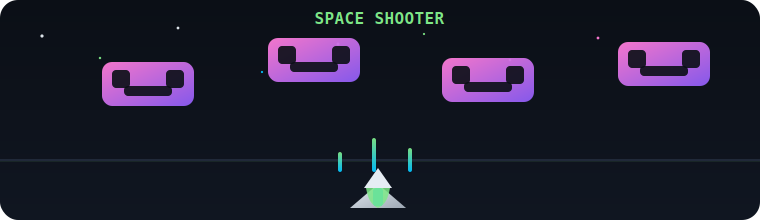

# About Me:
CS Student @ Ateneo de Davao. I build scalable software with a focus on clean code and high-performance UX. 
## Socials:

  

# Tech Stack:

  

## Contribution Activity:

  

## GitHub Trophies

  

